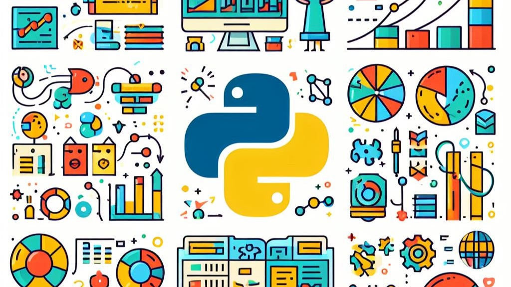

# Python Essentials for MLOps

- Tecnologias utilizadas: Python, PyLint, ChatGPT
- Video Youtube: https://www.youtube.com/watch?v=9stU74M3kd8
- Certificado: https://app.dataquest.io/verify_cert/XIZLW32XYSQ8P7KP7D14/

- Referências: ChatGPT, Dataquest.io
