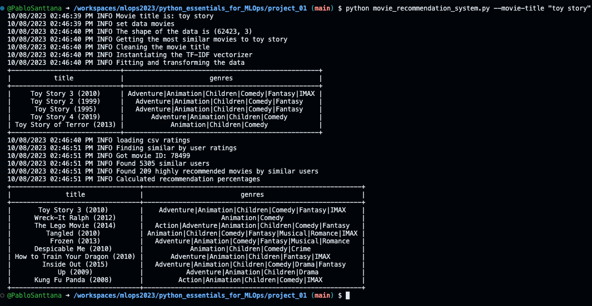
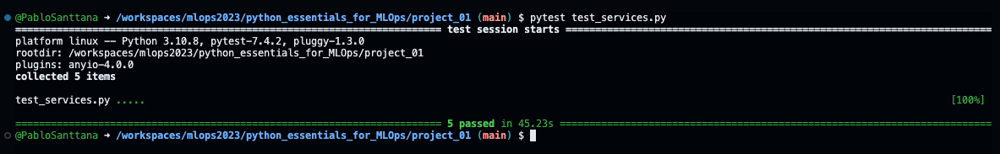
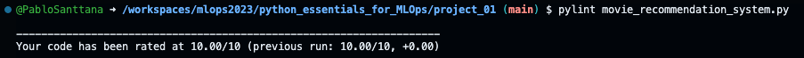

# Projeto Sistema de Recomendação de Filmes em python

Bem-vindo ao Sistema de Recomendação de Filmes! Este projeto oferece uma solução completa para recomendar filmes com base em diferentes critérios, como títulos de filmes similares e avaliações dos usuários. Ele também inclui funcionalidades para o download de dados, limpeza de títulos de filmes e impressão de tabelas de dados.

## Visão Geral

O projeto consiste em um conjunto de funções e utilitários implementados em Python para ajudar os usuários a descobrir e explorar filmes de maneira eficaz. Ele abrange as seguintes funcionalidades principais:

1. **Download e Extração de Dados:** Permite o download de conjuntos de dados de filmes a partir de URLs e extrai os arquivos ZIP correspondentes. Tratativas de erros robustas estão incorporadas para lidar com problemas comuns, como conexões fracas ou interrompidas.

2. **Limpeza de Títulos de Filmes:** Remove caracteres especiais e não alfanuméricos de títulos de filmes, tornando-os mais legíveis e fáceis de processar.

3. **Busca por Títulos de Filmes Similares:** Encontra títulos de filmes similares com base em um título fornecido. Esta função usa uma abordagem de análise de texto para determinar a similaridade entre títulos de filmes.

4. **Recomendação de Filmes com Base nas Avaliações dos Usuários:** Descobre filmes similares com base nas avaliações dos usuários. A função identifica usuários que classificaram um filme de forma positiva e recomenda outros filmes que esses usuários também apreciaram.

5. **Impressão de Tabelas de Dados:** Fornece uma maneira conveniente de exibir dados tabulares, facilitando a visualização e a análise de resultados.


## Pré-Requisitos

Antes de começar, certifique-se de ter os seguintes requisitos instalados:

- Python 3.6 ou superior
- Bibliotecas Python listadas em `requirements.txt`.

## Modo de Uso

Para usar o Sistema de Recomendação de Filmes, siga estas etapas simples:

1. Clone este repositório para o seu ambiente local ou use o codespace do github:

Execute o script movie_recommendation_system.py com o comando abaixo e substitua "Toy Story" pelo título do filme de sua escolha:

```
python movie_recommendation_system.py --movie-title "Toy Story"
```
A saída no seu terminal deve se assemelhar ao que é mostrado na imagem abaixo.



## codigo

1. Define variáveis importantes, como a URL de onde os dados serão baixados e o diretório de armazenamento.
2. Obtém o título do filme especificado pelo usuário a partir da linha de comando.
3. Realiza o download e extração dos dados relacionados a filmes a partir de uma URL.
4. Lê os dados dos filmes a partir de um arquivo CSV e armazena-os em um DataFrame.
5. Encontra filmes semelhantes com base no título do filme especificado.
6. Imprime os resultados dos filmes semelhantes.
7. Lê os dados de classificação dos filmes a partir de outro arquivo CSV.
8. Encontra filmes semelhantes com base nas classificações dos usuários.
10. Imprime os filmes recomendados com base nas classificações dos usuários, se houver algum.
    
O arquivo movie_recommendation_system.py, o código principal coordena o download, processamento e apresentação de filmes semelhantes com base em diferentes critérios, como título e classificações de usuários.

```python

URL = "https://files.grouplens.org/datasets/movielens/ml-25m.zip"
script_path = os.path.abspath(__file__)
base_directory = os.path.dirname(script_path)


title_movie = services.get_title_movie()
if title_movie == "Unknown":
    sys.exit()

services.download_and_extract(URL, base_directory)


# import data from moveis
logging.info("set data movies")
# Construct the path to the movies.csv file
movies_csv_path = os.path.join(base_directory, "ml-25m", "movies.csv")

movies_df = pd.read_csv(movies_csv_path)

# log the shape of the data
logging.info("The shape of the data is %s", movies_df.shape)

# get the most similar movies
logging.info("Getting the most similar movies to %s", title_movie)
results = services.get_similar_movie_titles(title_movie, movies_df)

# print the results
columns_to_include = ["title", "genres"]
services.print_dataframe_table(results, columns_to_include)

ratings_csv_path = os.path.join(base_directory, "ml-25m", "ratings.csv")
# read the ratings data

logging.info("loading csv ratings")

ratings_df = pd.read_csv(ratings_csv_path)

logging.info("Finding similar by user ratings")

# Get the first movie title from 'results'
first_movie_title = results.iloc[0]["title"]

top_recommendations_movies = services.discover_similar_movies(
    movies_df,
    ratings_df,
    first_movie_title
)

if top_recommendations_movies.empty:
    logging.warning("o similar movies were found.")
else:
    columns_to_include = ["title", "genres"]
    services.print_dataframe_table(
        top_recommendations_movies, columns_to_include)
```

A função download_and_extract é responsável por baixar e extrair um arquivo ZIP de uma URL especificada. Ela começa verificando se o diretório de saída já possui os dados, evitando downloads repetidos. Em seguida, valida a URL e o diretório de saída antes de iniciar o download. Durante o download, o arquivo é dividido em partes menores para monitorar o progresso. Após o download, o arquivo ZIP é extraído para o diretório de saída e, finalmente, o arquivo ZIP original é removido. A função também lida com exceções que podem ocorrer durante o processo, como erros de conexão, tempo limite, erro HTTP ou inválidação do arquivo ZIP. Essa função é essencial para adquirir os dados necessários para o sistema de recomendação de filmes.

```python 
def download_and_extract(url: str, output_dir: str) -> None:
    """
    Download the data from the given URL
    Args:
        url (str): The URL of the data
        output_dir (str): save output dir
    Returns:
        None
    """
    try:
        if not os.path.exists("ml-25m"):
            # Validate the URL and output directory
            if not url.startswith('http'):
                raise ValueError("Invalid URL.")
            if not os.path.isdir(output_dir):
                raise ValueError("Output directory does not exist.")

            # Extract the ZIP file name from the URL
            zip_filename = url.split('/')[-1]
            # Download the file

            zip_path = os.path.join(output_dir, zip_filename)

            with requests.Session() as session:
                response = session.get(url, stream=True, timeout=10)
                total_size = int(response.headers.get('content-length', 0))

                chunk_size = 128 * 1024
                total_chunks = total_size // chunk_size

                with open(zip_filename, 'wb') as file:
                    for data in tqdm.tqdm(response.iter_content(chunk_size=chunk_size),
                                          total=total_chunks,
                                          unit='KB',
                                          desc=zip_filename,
                                          leave=True):
                        file.write(data)

                logging.info("File downloaded to %s", zip_path)

                # Extract the ZIP file
                with zipfile.ZipFile(zip_path, 'r') as zip_ref:
                    zip_ref.extractall(output_dir)
                logging.info(
                    "Contents of the file extracted to %s", output_dir)

                # Remove the ZIP file
                os.remove(zip_path)
                logging.info("ZIP file deleted.")

    except requests.exceptions.ConnectionError:
        logging.error("Connection Error")
    except requests.exceptions.Timeout:
        logging.error("Timeout Error")
    except requests.exceptions.HTTPError:
        logging.error("HTTP Error")
    except zipfile.BadZipFile:
        logging.error("The downloaded file is not a valid ZIP file.")

```

## Testes Automatizados (pytest)

Este projeto utiliza testes automatizados para garantir o funcionamento correto das funcionalidades principais. Os testes são implementados no arquivo `test_services.py`.

### Fixture de Dados

No arquivo `conftest.py`, você encontrará um *fixture* que carrega os conjuntos de dados na memória para que possam ser utilizados nos testes. Isso garante que os testes sejam executados com dados consistentes e conhecidos.

### Importância dos Testes

Os testes são essenciais para:

- Verificar o comportamento correto das funcionalidades principais.
- Garantir que os dados sejam tratados de forma adequada, evitando erros durante a execução.
- Facilitar a manutenção futura, detectando problemas antecipadamente.
- Adicionar confiabilidade ao aplicativo, assegurando que ele funcione conforme o esperado.

Sinta-se à vontade para adicionar mais testes ao seu aplicativo; eles são uma ferramenta poderosa que economiza tempo de depuração e ajuda a manter a qualidade do código.

Para executar todos os testes, basta executar o comando abaixo:
```bash
pytest
```
Para executar um arquivo de teste específico de um projeto:
```bash
pytest test_service.py
```



## Princípios de código limpo

Princípios de código limpo são diretrizes e boas práticas que os desenvolvedores seguem para criar código fonte que seja fácil de ler, entender, manter e colaborar. No projeto mencionado, vários princípios de código limpo podem ser identificados, e eles desempenham um papel fundamental na criação de um código de qualidade. Alguns desses princípios incluem:

1. **Nomes Significativos**: Por exemplo, nomes como download_and_extract e clean_title_movie são autoexplicativos.
2. **Métodos Pequenos e Funções Concisas**: As funções e métodos são mantidos curtos, realizando uma única tarefa bem definida. Isso facilita a compreensão do que cada função faz.
3. **Modularização**: O código é dividido em módulos e pacotes lógicos. Cada módulo se concentra em uma funcionalidade específica, promovendo a reutilização e a organização.
4. **Testes Automatizados**: Testes unitários, de integração e de aceitação são usados para verificar a funcionalidade do código. Isso ajuda a identificar problemas rapidamente e a manter o código confiável.
5. **Evitar Duplicação de Código**: A duplicação de código é minimizada, seguindo o princípio "DRY" (Don't Repeat Yourself). Funções e classes reutilizáveis são criadas quando necessário.

No projeto, foram aplicados princípios de código limpo para garantir que o código seja organizado, legível e fácil de manter. Isso incluiu o uso de nomes significativos, funções e métodos concisos, comentários explicativos, modularização, testes automatizados, evitando duplicação de código, aderindo a padrões de codificação e refatoração quando necessário.

Além disso, o módulo logging do Python foi amplamente utilizado para registrar informações, avisos e erros durante a execução do código. Isso ajuda no diagnóstico de problemas, no rastreamento do fluxo de execução e na documentação de eventos importantes.

O uso eficaz de logging permite que os desenvolvedores identifiquem e resolvam problemas de forma mais eficiente, garantindo a robustez e a confiabilidade do sistema de recomendação de filmes. A clareza e a organização do código, juntamente com o logging adequado, são práticas essenciais para o desenvolvimento de software de qualidade.

```python

def clean_title_movie(movie_title: str):
    """
    Cleans a movie title by removing special characters and non-alphanumeric characters.

    Args:
        movie_title (str): The movie title to be cleaned.

    Returns:
        str: The cleaned movie title.
    """
    title = re.sub("[^a-zA-Z0-9 ]", "", movie_title)
    return title

```


## pylint

O uso do pylint no projeto desempenhou um papel fundamental na garantia da qualidade do código Python. Essa ferramenta realizou análises estáticas do código, identificando erros, avisos e más práticas antes mesmo da execução do programa. Além disso, o pylint verificou se o código seguia as convenções de codificação, padrões de nomenclatura e complexidade recomendados pela comunidade Python.

Isso resultou em um código mais limpo, legível e de alta qualidade. A detecção precoce de problemas e a manutenção das boas práticas de programação contribuíram para um desenvolvimento eficiente e colaborativo. A integração do pylint em fluxos de trabalho de CI/CD automatizou a análise de código, garantindo a consistência e a qualidade em cada alteração.

Em resumo, o uso do pylint foi essencial para a criação de um código Python confiável, fácil de manter e alinhado com as melhores práticas de programação.

Comando para executar pylint:

```bash
    pylint filename
```

execução do pylint no Projeto.

* ```pylint movie_recommendation_system.py```
  


* ```pylint services.py```
  


* ```pylint test_services.py```
  


