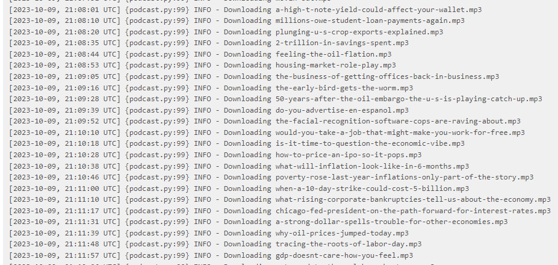

# Airflow Data Pipeline to Download Podcasts


- **Nome:** Guilherme Pablo de Santana Maciel
- **Faculdade:** Universidade Federal do Rio Grande do Norte
- **Disciplina:** Projeto de Sistemas Baseados em Aprendizado de Máquina
- **Professor:** Ivanovitch Medeiros Dantas da Silva

O projeto utiliza o Apache Airflow para automatizar a coleta de episódios de podcast, o armazenamento de informações relevantes em um banco de dados SQLite, o download de episódios de áudio e a transcrição desses episódios em texto. Essa automação é configurada para ser executada diariamente, facilitando o processo de criação e gerenciamento de um pipeline de dados para tarefas de aprendizado de máquina.

Sinta-se à vontade para personalizar este resumo conforme necessário para se adequar ao seu projeto específico.

## Visão Geral

O projeto em questão utiliza a plataforma Apache Airflow, conhecida por sua capacidade de automação de fluxos de trabalho, para criar um pipeline de dados que automatiza diversas etapas do processo de gerenciamento de informações relacionadas a episódios de podcast. Abaixo, detalhamos os principais componentes e passos desse projeto:

**Coleta de Dados**: A primeira etapa do projeto envolve a coleta de dados de episódios de podcast a partir de uma fonte externa, especificamente a URL do podcast desejado. Isso é realizado por meio da biblioteca requests, que permite fazer solicitações HTTP, e da biblioteca xmltodict, utilizada para analisar o feed XML resultante. Os episódios são então extraídos do feed e manipulados como dicionários Python.

**Armazenamento de Dados**: Os dados referentes aos episódios são armazenados em um banco de dados SQLite, com o auxílio da biblioteca sqlite3. Caso o banco de dados SQLite não exista, o projeto o cria automaticamente, configurando uma tabela denominada "episodes" para armazenar as informações dos episódios.

**Download de Áudio**: Outra funcionalidade importante do projeto é o download dos arquivos de áudio dos episódios de podcast para um diretório local. Isso é possível graças ao uso da biblioteca requests, que realiza os downloads, e da biblioteca pydub, utilizada para manipular os arquivos de áudio. É possível também definir características como a taxa de amostragem e o número de canais dos arquivos de áudio baixados.

**Transcrição de Áudio para Texto**: O projeto inclui uma etapa opcional que permite a transcrição dos episódios de áudio para texto. Essa funcionalidade utiliza o modelo de reconhecimento de fala Vosk. Vale destacar que essa etapa pode requerer configurações adicionais e, por padrão, não está habilitada.

**Agendamento Automatizado**: O projeto é configurado para ser executado automaticamente em intervalos regulares, no caso, diariamente. Isso é possível graças ao Apache Airflow, que permite a configuração e programação de tarefas automatizadas.

**Testes Unitários**: Para garantir o correto funcionamento das principais funções do projeto, são incluídos testes unitários, os quais são executados utilizando a biblioteca pytest.

Em resumo, este projeto demonstra como aproveitar o potencial do Apache Airflow para automatizar o processo de coleta, armazenamento e processamento de dados relacionados a episódios de podcast. Ele oferece um pipeline de dados eficiente que pode ser configurado e agendado para execução automática, tornando-o uma ferramenta valiosa para atividades de aprendizado de máquina e análise de dados.


## Pré-Requisitos

Antes de começar, certifique-se de ter os seguintes requisitos instalados:

- Python 3.6 ou superior

### Configuração do Ambiente Virtual
Para melhor isolamento do ambiente e gerenciamento de dependências, é altamente recomendável criar e ativar um ambiente virtual Python. Siga os passos abaixo:

Crie um ambiente virtual usando Python 3.10 (ou a versão desejada) com o seguinte comando:

```bash
python3 -m venv airflow
```

Ative o ambiente virtual com o seguinte comando:

```bash
source ./airflow/bin/activate
```
### Instalação do Apache Airflow
Para instalar o Apache Airflow, você pode usar o seguinte comando, que também inclui a especificação de restrições de versão:

```bash
CONSTRAINT_URL="https://raw.githubusercontent.com/apache/airflow/constraints-2.3.1/constraints-3.8.txt"
pip install "apache-airflow==2.3.1" --constraint "${CONSTRAINT_URL}"
```
- Bibliotecas Python listadas em `requirements.txt`.

```bash
pip install -r requirements.txt
```

Para executar o projeto com o Apache Airflow em modo standalone

```bash
airflow standalone
```
Isso executará o Apache Airflow no endereço localhost:8080.

O próximo passo é configurar o caminho para suas DAGs. Para fazer isso, você deve editar o arquivo de configuração em ~/airflow/config.cfg. Localize a seção que especifica o caminho para as DAGs e atualize-o para o diretório onde suas DAGs estão localizadas. Por exemplo:

```python
dags_folder = /home/pablo/mlops2023/python_essentials_for_MLOps/project_02/dags
```

## Modo de Uso

Para usar o Sistema, siga estas etapas simples entra no localhost:8080 e acessa a DAG podcast_summary


Para configurar e usar uma DAG no Apache Airflow e acessar o log resumo através da interface gráfica, siga estas etapas:

Certifique-se de ter o Apache Airflow configurado e em execução.

Acesse a interface da web do Apache Airflow em um navegador.

Vá para a guia "DAGs" para visualizar todas as suas DAGs disponíveis.

Escolha a DAG da qual deseja acessar o log resumo.

Na visualização da DAG, clique na tarefa específica para a qual deseja visualizar o log resumo.

Na página de detalhes da tarefa, vá para a guia "Logs".

O log resumo da tarefa será exibido na janela ou painel, permitindo que você revise os registros de execução.

Copie o conteúdo do log resumo conforme necessário e inclua-o em seu arquivo README para documentação.

Usar a interface gráfica do Apache Airflow facilita o acesso aos logs e monitoramento das DAGs e tarefas, tornando-o útil para depuração e análise de execuções anteriores.

exemplo log da task download_episodes



## codigo
    
O arquivo podcast.py contém a implementação de um pipeline de dados automatizado para coletar, armazenar e processar informações relacionadas a episódios de podcast

A DAG podcast_summary é responsável por orquestrar e automatizar todo o processo definido no código do arquivo podcast.py. Ela coordena a execução das tarefas e etapas do pipeline de processamento de dados de podcast. Aqui está uma visão geral das principais responsabilidades da DAG podcast_summary no código:

```python
def podcast_summary():
    """
    This function defines the workflow for the podcast processing DAG.

    It creates a database, fetches podcast episodes, loads them into the database,
    and downloads audio files. You can also uncomment the 'speech_to_text' call
    to enable speech-to-text transcription (may not work).

    Returns:
        None
    """
    create_database = create_database_episodes()

    podcast_episodes = get_request_episodes()
    create_database.set_downstream(podcast_episodes)

    load_databese_episodes(podcast_episodes)

    download_episodes(podcast_episodes)

    #Uncomment this to try speech to text (may not work)
    #speech_to_text(audio_files, new_episodes)

```


**A TASK download_episodes** é responsável por baixar os episódios de podcast como arquivos de áudio. Ela itera sobre uma lista de episódios, verifica se os arquivos de áudio correspondentes já existem e, se não existirem, realiza o download dos arquivos a partir das URLs fornecidas nos episódios. A função também registra informações sobre os arquivos baixados com sucesso, incluindo os links dos episódios e os nomes dos arquivos baixados. Isso permite que o projeto automatize o processo de download de episódios de podcast para processamento posterior.


```python
@task()
def download_episodes(episodes):
    """
    Download podcast episodes as audio files.

    This function takes a list of podcast episodes and downloads their audio files
    if they do not already exist in the specified folder.

    Args:
        episodes (list): A list of podcast episodes as dictionaries.

    Returns:
        list: A list of downloaded audio files (dictionary with link and filename).
    """
    audio_files = []
    for episode in episodes:
        name_end = episode["link"].split('/')[-1]
        filename = f"{name_end}.mp3"
        audio_path = os.path.join(EPISODE_FOLDER, filename)
        try:
            if not os.path.exists(audio_path):
                logging.info("Downloading %s", filename)
                audio = requests.get(episode["enclosure"]["@url"], timeout=15)
                audio.raise_for_status()  # Raise an exception if the request is not successful
                with open(audio_path, "wb+") as audio_file:
                    audio_file.write(audio.content)
                audio_files.append({
                    "link": episode["link"],
                    "filename": filename
                })
            else:
                logging.info("Skipped downloading %s as it already exists.", filename)
        except requests.exceptions.RequestException as request_error:
            logging.error("HTTP request error for episode %s: %s",
                          episode['link'],
                          str(request_error))
            continue
        except IOError as io_error:
            logging.error("IO error while downloading episode %s: %s",
                          episode['link'],
                          str(io_error))
            continue
    return audio_files
```

## Princípios de código limpo

Princípios de código limpo são diretrizes e boas práticas que os desenvolvedores seguem para criar código fonte que seja fácil de ler, entender, manter e colaborar. No projeto mencionado, vários princípios de código limpo podem ser identificados, e eles desempenham um papel fundamental na criação de um código de qualidade. Alguns desses princípios incluem:

1. **Nomes Significativos**: Por exemplo, nomes como download_and_extract e clean_title_movie são autoexplicativos.
2. **Métodos Pequenos e Funções Concisas**: As funções e métodos são mantidos curtos, realizando uma única tarefa bem definida. Isso facilita a compreensão do que cada função faz.
3. **Modularização**: O código é dividido em módulos e pacotes lógicos. Cada módulo se concentra em uma funcionalidade específica, promovendo a reutilização e a organização.
4. **Testes Automatizados**: Testes unitários, de integração e de aceitação são usados para verificar a funcionalidade do código. Isso ajuda a identificar problemas rapidamente e a manter o código confiável.
5. **Evitar Duplicação de Código**: A duplicação de código é minimizada, seguindo o princípio "DRY" (Don't Repeat Yourself). Funções e classes reutilizáveis são criadas quando necessário.

No projeto, foram aplicados princípios de código limpo para garantir que o código seja organizado, legível e fácil de manter. Isso incluiu o uso de nomes significativos, funções e métodos concisos, comentários explicativos, modularização, testes automatizados, evitando duplicação de código, aderindo a padrões de codificação e refatoração quando necessário.

Além disso, o módulo logging do Python foi amplamente utilizado para registrar informações, avisos e erros durante a execução do código. Isso ajuda no diagnóstico de problemas, no rastreamento do fluxo de execução e na documentação de eventos importantes.

O uso eficaz de logging permite que os desenvolvedores identifiquem e resolvam problemas de forma mais eficiente, garantindo a robustez e a confiabilidade do sistema de recomendação de filmes. A clareza e a organização do código, juntamente com o logging adequado, são práticas essenciais para o desenvolvimento de software de qualidade.

```python
def get_request_episodes() -> list:
    """
    Fetch podcast episodes from the specified URL.

    This function sends an HTTP GET request to the PODCAST_URL and parses the
    response to extract podcast episodes. It handles exceptions related to
    HTTP requests and XML parsing.

    Returns:
        list: A list of podcast episodes as dictionaries.
    """
    try:
        logging.info("Fetching episodes.")
        data = requests.get(PODCAST_URL,timeout=15)
        # Raises an exception if the HTTP request is not successful.
        data.raise_for_status()
        feed = xmltodict.parse(data.text)
        episodes = feed["rss"]["channel"]["item"]
        logging.info("Found %s episodes.", len(episodes))
        return episodes
    except requests.exceptions.RequestException as requests_error:
        # Catches exceptions related to HTTP requests, such as failed connections.
        logging.error("HTTP request error: %s", str(requests_error))
        return []  # Retorna uma lista vazia em caso de erro

    except (KeyError, ValueError, TypeError) as erro_all:
        # Catches exceptions related to XML parsing or invalid data structure.
        logging.error("XML parsing error or invalid data structure: %s", str(erro_all))
        return []  # Retorna uma lista vazia em caso de erro.

```


## pylint

O uso do pylint no projeto desempenhou um papel fundamental na garantia da qualidade do código Python. Essa ferramenta realizou análises estáticas do código, identificando erros, avisos e más práticas antes mesmo da execução do programa. Além disso, o pylint verificou se o código seguia as convenções de codificação, padrões de nomenclatura e complexidade recomendados pela comunidade Python.

Isso resultou em um código mais limpo, legível e de alta qualidade. A detecção precoce de problemas e a manutenção das boas práticas de programação contribuíram para um desenvolvimento eficiente e colaborativo. A integração do pylint em fluxos de trabalho de CI/CD automatizou a análise de código, garantindo a consistência e a qualidade em cada alteração.

Em resumo, o uso do pylint foi essencial para a criação de um código Python confiável, fácil de manter e alinhado com as melhores práticas de programação.

Comando para executar pylint:

```bash
    pylint filename
```

execução do pylint no Projeto.

* ```pylint podcast.py```
  


## direitos autorais 

Este projeto é uma adaptação do original desenvolvido como proposta para portifolio do [Dataquest](https://app.dataquest.io/c/93/m/999911/build-an-airflow-data-pipeline-to-download-podcasts/1/project-overview-and-setting-up). Aprimora o [código-fonte original](https://github.com/dataquestio/project-walkthroughs/blob/master/podcast_summary/podcast_summary.py), aplicando princípios de organização, código limpo e testes unitários.

As melhorias na organização do código tornam-no mais legível e fácil de manter. A adesão aos princípios de código limpo resulta em um código mais eficiente e bem estruturado, seguindo as melhores práticas da indústria de desenvolvimento de software.

Em resumo, este projeto é uma evolução do Airflow Data Pipeline to Download Podcasts original, destacando a importância da organização do código, qualidade e confiabilidade, tornando-o uma ferramenta valiosa para o aprendizado em desenvolvimento de software.

## Referências

* [Repositório ivanovitchm](https://github.com/ivanovitchm/mlops)
* [Repositório Dataquest Airflow Data Pipeline to Download Podcasts ](https://github.com/dataquestio/project-walkthroughs/blob/master/podcast_summary/podcast_summary.py)


