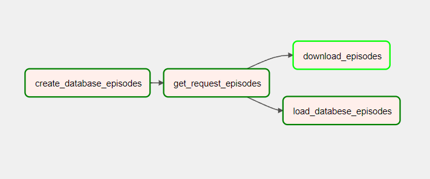
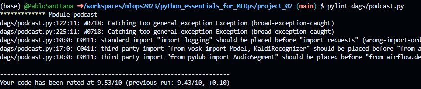

# Projeto Prevendo Custos de Seguro

- **Nome:** Guilherme Pablo de Santana Maciel
- **Faculdade:** Universidade Federal do Rio Grande do Norte
- **Disciplina:** Projeto de Sistemas Baseados em Aprendizado de Máquina
- **Professor:** Ivanovitch Medeiros Dantas da Silva

Bem-vindo ao projeto de Modelagem de Regressão Linear em Python! Este projeto utiliza técnicas de regressão linear para prever custos médicos com base em dados demográficos e características pessoais dos pacientes. Utilizamos o conjunto de dados de Custos Médicos do Kaggle e aplicamos o conhecimento adquirido no curso para construir um modelo preditivo eficaz. A previsão de custos médicos é fundamental para hospitais e seguradoras, e este projeto serve como um exemplo de como aplicar a regressão linear em problemas do mundo real.

Sinta-se à vontade para personalizar este resumo conforme necessário para se adequar ao seu projeto específico.

## Visão Geral

O projeto de Modelagem de Regressão Linear em Python tem como objetivo aplicar conceitos e técnicas de regressão linear a um cenário do mundo real. Neste projeto, utilizaremos o conjunto de dados de Custos Médicos do Kaggle, que contém informações sobre contas individuais de seguros médicos.

### Objetivo

O principal objetivo deste projeto é desenvolver um modelo de regressão linear que seja capaz de prever os custos médicos com base em diversas variáveis, como idade, índice de massa corporal (IMC), hábitos de fumar e outras características dos pacientes. A previsão de custos médicos é importante tanto para hospitais quanto para seguradoras, permitindo uma melhor gestão financeira e planejamento de recursos.

### Metodologia

O projeto seguirá as seguintes etapas:

1. **Exploração de Dados:** Inicialmente, exploraremos o conjunto de dados para compreender suas características e distribuições.

2. **Pré-processamento de Dados:** Realizaremos etapas de pré-processamento, como tratamento de valores ausentes, codificação de variáveis categóricas e normalização de dados.

3. **Análise de Correlação:** Investigaremos as correlações entre as variáveis independentes e a variável alvo (custos médicos).

4. **Construção do Modelo:** Utilizaremos a regressão linear para construir o modelo de previsão de custos médicos.

5. **Avaliação do Modelo:** Avaliaremos o desempenho do modelo utilizando métricas como o Erro Médio Quadrático (MSE) e o Coeficiente de Determinação (R-squared).

6. **Interpretação de Resultados:** Interpretaremos os coeficientes do modelo para entender como cada variável influencia os custos médicos.

7. **Visualização de Resultados:** Apresentaremos os resultados por meio de gráficos e visualizações para tornar as conclusões mais compreensíveis.


## Pré-Requisitos

Antes de começar, certifique-se de ter os seguintes requisitos instalados:

- Python 3.6 ou superior
- Bibliotecas Python listadas em `requirements.txt`.

## Modo de Uso

Para usar o Sistema, siga estas etapas simples:

1. Clone este repositório para o seu ambiente local ou use o codespace do github:

Execute o script predicting_insurance_costs.py

```
python predicting_insurance_costs.py
```
A saída no seu terminal deve se assemelhar ao que é mostrado na imagem abaixo.



## codigo
    
O arquivo predicting_insurance_costs.py, o código principal coordena a leitura do csv, processamento e apresentação das infomaçōes

```python
try:
    FILE_PATH = "./dataset/insurance.csv"
    insurance_df = services.read_dataset(FILE_PATH)
    services.print_dataframe_table(insurance_df)

    insurance_df = services.transform_data(insurance_df)
    services.print_dataframe_table(insurance_df)

    X_train, X_test, y_train, y_test = services.split_data(insurance_df)
    insurance_model = services.train_model(X_train, y_train)
    result_in_original_scale = services.evaluate_model(insurance_model,
                                                       X_train, y_train,
                                                       X_test, y_test)

    logging.info("Final score on the test set: %s", str(result_in_original_scale))
except FileNotFoundError as file_not_found:
    logging.error("File not found: %s", str(file_not_found))
except KeyError as key_error:
    logging.error("Key error: %s", str(key_error))
```

# funçōes importantes

## Avaliação do Modelo

A função `evaluate_model` tem como objetivo avaliar o desempenho de um modelo de aprendizado de máquina nos conjuntos de treinamento e teste. Esta avaliação é essencial para entender quão bem o modelo se ajusta aos dados e como ele realiza previsões.

### Parâmetros

- `insurance_model`: O modelo de regressão linear previamente treinado.
- `x_train`: A matriz de características do conjunto de treinamento.
- `y_train`: A variável alvo do conjunto de treinamento.
- `x_test`: A matriz de características do conjunto de teste.
- `y_test`: A variável alvo do conjunto de teste.

### Avaliação de Desempenho

A função realiza as seguintes etapas de avaliação:

1. **Avaliação no Conjunto de Treinamento:** Primeiro, o modelo é usado para prever os valores alvo no conjunto de treinamento. Em seguida, são calculados o Erro Quadrático Médio (MSE) nos termos logarítmicos e o coeficiente de determinação (R-squared) para avaliar o ajuste do modelo aos dados de treinamento.

2. **Coeficientes Não Interceptados:** Também são obtidos os coeficientes não interceptados do modelo, que representam o impacto das características nos resultados.

3. **Avaliação no Conjunto de Teste:** O modelo é aplicado ao conjunto de teste, e o MSE nos termos logarítmicos e na escala original é calculado para avaliar o desempenho nas previsões de teste.

### Tratamento de Erros

A função inclui um mecanismo de tratamento de exceções para lidar com possíveis erros durante a avaliação do modelo. Se ocorrer algum erro, uma mensagem de erro será registrada e a exceção será relançada para tratamento posterior.

Em resumo, a função `evaluate_model` é fundamental para entender o quão eficaz é o modelo treinado na previsão dos custos de seguro médico. Ela fornece métricas valiosas que ajudam a avaliar a qualidade do modelo e seu desempenho nos dados de treinamento e teste.

```python
def evaluate_model(insurance_model, x_train, y_train, x_test, y_test):
    """
    Evaluate the performance of a machine learning model on training and test sets.

    Parameters:
    - model: The trained machine learning model.
    - X_train: The feature matrix of the training set.
    - y_train: The target variable of the training set.
    - X_test: The feature matrix of the test set.
    - y_test: The target variable of the test set.

    Returns:
    - mse_test_original_scale: Mean Squared Error (MSE) on the test set in the original scale.
    """
    try:
        logging.info("Evaluating model performance on the training set")
        y_pred_train = insurance_model.predict(x_train)
        mse_train = mean_squared_error(y_train, y_pred_train)
        logging.info("MSE on the training set (log-terms): %s", str(mse_train))
        mse_train_original_scale = np.exp(mse_train)
        logging.info("MSE on the training set (original scale): %s",str(mse_train_original_scale))

        logging.info("Calculating the coefficient of determination (R-squared) on the training set")
        r2_train = r2_score(y_train, y_pred_train)
        logging.info("R-squared on the training set: %s",str(r2_train))
        non_intercept_coefficients = insurance_model.coef_

        logging.info("Getting the non-intercept coefficients: %s", non_intercept_coefficients)

        logging.info("Evaluating model performance on the test set")
        y_pred_test = insurance_model.predict(x_test)
        mse_test = mean_squared_error(y_test, y_pred_test)
        logging.info("MSE on the test set (log-terms): %s", str(mse_test))
        mse_test_original_scale = np.exp(mse_test)
        logging.info("MSE on the test set (original scale): %s", str(mse_test_original_scale))

        return mse_test_original_scale
    except Exception as exception:
        logging.error("Error evaluating the model: %s", str(exception))
        raise
```

## Testes Automatizados (pytest)

Este projeto utiliza testes automatizados para garantir o funcionamento correto das funcionalidades principais. Os testes são implementados no arquivo `test_services.py`.


### Importância dos Testes

Os testes são essenciais para:

- Verificar o comportamento correto das funcionalidades principais.
- Garantir que os dados sejam tratados de forma adequada, evitando erros durante a execução.
- Facilitar a manutenção futura, detectando problemas antecipadamente.
- Adicionar confiabilidade ao aplicativo, assegurando que ele funcione conforme o esperado.

Sinta-se à vontade para adicionar mais testes ao seu aplicativo; eles são uma ferramenta poderosa que economiza tempo de depuração e ajuda a manter a qualidade do código.

Para executar todos os testes, basta executar o comando abaixo:
```bash
pytest
```
Para executar um arquivo de teste específico de um projeto:
```bash
pytest test_service.py
```


## Princípios de código limpo

Princípios de código limpo são diretrizes e boas práticas que os desenvolvedores seguem para criar código fonte que seja fácil de ler, entender, manter e colaborar. No projeto mencionado, vários princípios de código limpo podem ser identificados, e eles desempenham um papel fundamental na criação de um código de qualidade. Alguns desses princípios incluem:

1. **Nomes Significativos**: Por exemplo, nomes como download_and_extract e clean_title_movie são autoexplicativos.
2. **Métodos Pequenos e Funções Concisas**: As funções e métodos são mantidos curtos, realizando uma única tarefa bem definida. Isso facilita a compreensão do que cada função faz.
3. **Modularização**: O código é dividido em módulos e pacotes lógicos. Cada módulo se concentra em uma funcionalidade específica, promovendo a reutilização e a organização.
4. **Testes Automatizados**: Testes unitários, de integração e de aceitação são usados para verificar a funcionalidade do código. Isso ajuda a identificar problemas rapidamente e a manter o código confiável.
5. **Evitar Duplicação de Código**: A duplicação de código é minimizada, seguindo o princípio "DRY" (Don't Repeat Yourself). Funções e classes reutilizáveis são criadas quando necessário.

No projeto, foram aplicados princípios de código limpo para garantir que o código seja organizado, legível e fácil de manter. Isso incluiu o uso de nomes significativos, funções e métodos concisos, comentários explicativos, modularização, testes automatizados, evitando duplicação de código, aderindo a padrões de codificação e refatoração quando necessário.

Além disso, o módulo logging do Python foi amplamente utilizado para registrar informações, avisos e erros durante a execução do código. Isso ajuda no diagnóstico de problemas, no rastreamento do fluxo de execução e na documentação de eventos importantes.

O uso eficaz de logging permite que os desenvolvedores identifiquem e resolvam problemas de forma mais eficiente, garantindo a robustez e a confiabilidade do sistema de recomendação de filmes. A clareza e a organização do código, juntamente com o logging adequado, são práticas essenciais para o desenvolvimento de software de qualidade.

```python
    try:
        logging.info("Evaluating model performance on the training set")
        y_pred_train = insurance_model.predict(x_train)
        mse_train = mean_squared_error(y_train, y_pred_train)
        logging.info("MSE on the training set (log-terms): %s", str(mse_train))
        mse_train_original_scale = np.exp(mse_train)
        logging.info("MSE on the training set (original scale): %s",str(mse_train_original_scale))

        logging.info("Calculating the coefficient of determination (R-squared) on the training set")
        r2_train = r2_score(y_train, y_pred_train)
        logging.info("R-squared on the training set: %s",str(r2_train))
        non_intercept_coefficients = insurance_model.coef_

        logging.info("Getting the non-intercept coefficients: %s", non_intercept_coefficients)

        logging.info("Evaluating model performance on the test set")
        y_pred_test = insurance_model.predict(x_test)
        mse_test = mean_squared_error(y_test, y_pred_test)
        logging.info("MSE on the test set (log-terms): %s", str(mse_test))
        mse_test_original_scale = np.exp(mse_test)
        logging.info("MSE on the test set (original scale): %s", str(mse_test_original_scale))

        return mse_test_original_scale
    except Exception as exception:
        logging.error("Error evaluating the model: %s", str(exception))
        raise

```


## pylint

O uso do pylint no projeto desempenhou um papel fundamental na garantia da qualidade do código Python. Essa ferramenta realizou análises estáticas do código, identificando erros, avisos e más práticas antes mesmo da execução do programa. Além disso, o pylint verificou se o código seguia as convenções de codificação, padrões de nomenclatura e complexidade recomendados pela comunidade Python.

Isso resultou em um código mais limpo, legível e de alta qualidade. A detecção precoce de problemas e a manutenção das boas práticas de programação contribuíram para um desenvolvimento eficiente e colaborativo. A integração do pylint em fluxos de trabalho de CI/CD automatizou a análise de código, garantindo a consistência e a qualidade em cada alteração.

Em resumo, o uso do pylint foi essencial para a criação de um código Python confiável, fácil de manter e alinhado com as melhores práticas de programação.

Comando para executar pylint:

```bash
    pylint filename
```

execução do pylint no Projeto.

* ```pylint predicting_insurance_costs.py```
  


* ```pylint services.py```
  


* ```pylint test_services.py```
  


## direitos autorais 

Este projeto é uma adaptação do original desenvolvido como a tividade do curso Machine Learning in Python da secao Linear Regression Modeling in Python[Dataquest](https://app.dataquest.io/learning-path/machine-learning-in-python-skill). Aprimora o [código-fonte original](https://github.com/dataquestio/solutions/blob/master/Mission730Solutions.ipynb), aplicando princípios de organização, código limpo e testes unitários.

As melhorias na organização do código tornam-no mais legível e fácil de manter. A adesão aos princípios de código limpo resulta em um código mais eficiente e bem estruturado, seguindo as melhores práticas da indústria de desenvolvimento de software.

A principal adição é a inclusão de testes unitários, que desempenham um papel vital na verificação do comportamento correto do sistema e na detecção precoce de problemas, aumentando a confiabilidade e a robustez do sistema.

Em resumo, este projeto é uma evolução do Predicting Insurance Costs original, destacando a importância da organização do código, qualidade e confiabilidade por meio de testes rigorosos, tornando-o uma ferramenta valiosa para o aprendizado em desenvolvimento de software.

## Referências

* [Repositório ivanovitchm](https://github.com/ivanovitchm/mlops)
* [Repositório Dataquest Predicting Insurance Costs ](https://github.com/dataquestio/solutions/blob/master/Mission730Solutions.ipynb)


